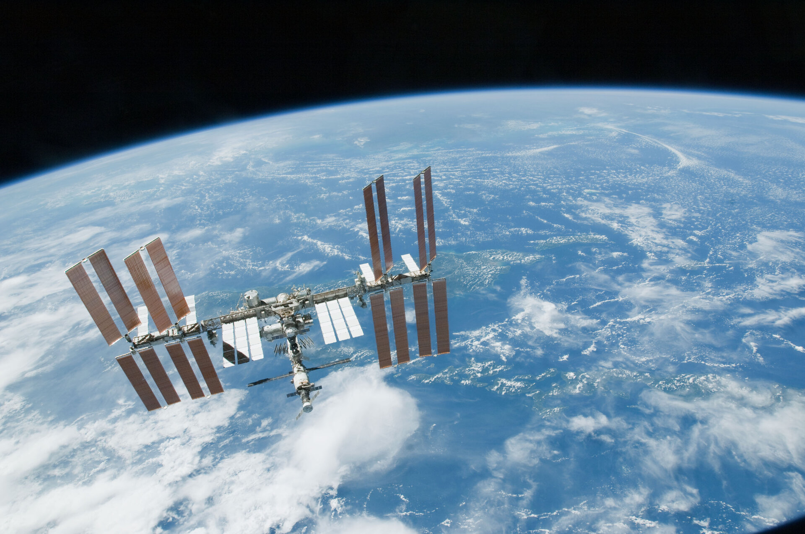
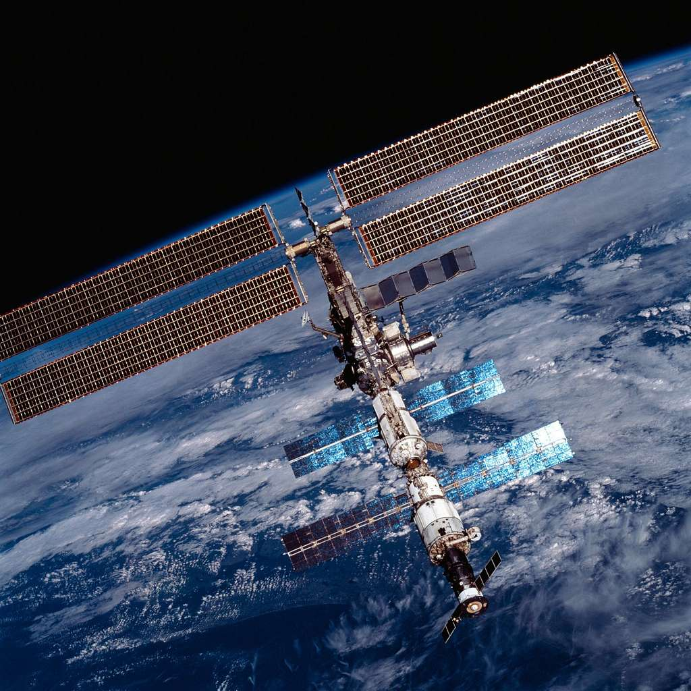

# Q Applet: ISS Tracker

Track the International Space Station (ISS) in real time directly on your Das Keyboard Q series.

## 🚀 Features

- 🟢 **Green blink** when ISS is overhead (within 500 km)
- 🟡 **Yellow blink** when ISS is very close (within 1000 km)
- 🟠 **Orange blink** when ISS is nearby (within 2000 km)
- 🔴 **Red steady glow** when ISS is far away
- 🌐 Accurate real-time ISS tracking using live location data from [Open Notify API](http://api.open-notify.org/iss-now.json)
- 🧠 Built-in haversine distance calculation between you and the ISS

## 🧭 Setup Instructions

1. **Install the applet** on Das Keyboard Q software
2. **Assign the applet to any key** on your keyboard
3. **Enter your latitude and longitude** in the applet configuration
4. **Watch the key light up** based on the ISS's position!

> Tip: When the key turns green and starts blinking, **look up** – the ISS might be directly overhead!

---

## 🇺🇸 Entering Your Location (USA Only)

To track the ISS from your location, just enter your **5-digit US postal code**.

You can find your postal code by:

- Looking at your mailing address
- Searching online: “postal code for [Your City, State]”
- Using your phone’s weather app or GPS

## Example

ISS Tracker on escape key.

## Changelog

[CHANGELOG.MD](CHANGELOG.md)

## Installation

Requires a Das Keyboard Q series: www.daskeyboard.com

Installation, configuration and uninstallation of applets is done within
the Q Desktop application (<https://www.daskeyboard.com/q>)

## Running tests

    yarn test

## Contributions

Pull requests welcome.
