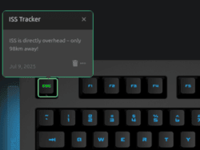

# Q Applet: ISS Tracker

## Example

ISS Tracker on escape key.

## Changelog

[CHANGELOG.MD](CHANGELOG.md)

## Installation

Requires a Das Keyboard Q series: www.daskeyboard.com

Installation, configuration and uninstallation of applets is done within
the Q Desktop application (<https://www.daskeyboard.com/q>)

## Running tests

    yarn test

## Contributions

Pull requests welcome.
